# Whitby Beach Clean

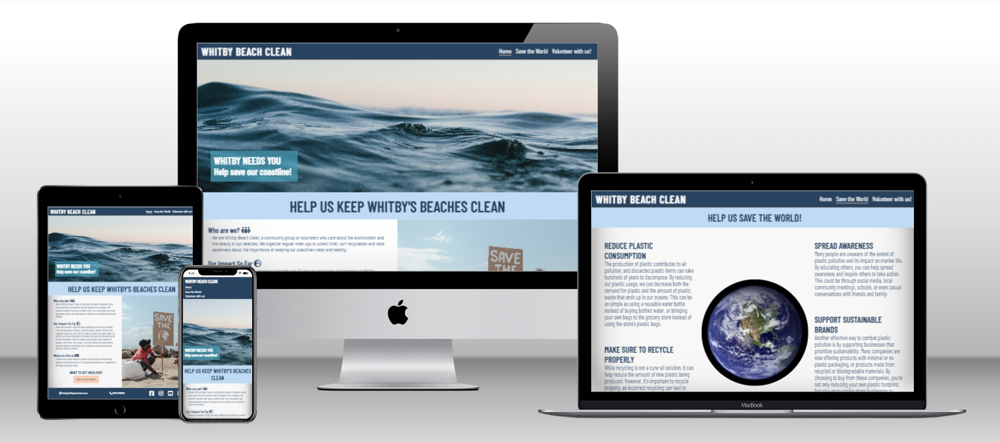

Whitby beach clean is a fictional community group located in the town of Whitby in Yorkshire, England. The group organises local events for all to help keep the beaches of the town clean and aims to educate members and the public on how to reduce plastic and ocean pollution.

The purpose of this website is to promote the community group and its events in the Whitby area. The target audience is both new and existing members of the community and of any demographic.

Please find a link to the deployed site [here](https://rdawson96.github.io/WhitbyBC/)

## Table of Contents

- [Whitby Beach Clean](#whitby-beach-clean)
  - [Table of Contents](#table-of-contents)
  - [User Experience](#user-experience)
    - [Project Goals](#project-goals)
    - [Colours Used](#colours-used)
    - [Wireframes](#wireframes)
  - [Features](#features)
    - [General Features](#general-features)
    - [Landing page](#landing-page)
    - [Save the world page](#save-the-world-page)
    - [Volunteer page](#volunteer-page)
  - [Frameworks and Programs Used](#frameworks-and-programs-used)
    - [Languages used](#languages-used)
  - [Testing](#testing)
    - [Validator Testing](#validator-testing)
      - [Validation Errors](#validation-errors)
        - [HTML](#html)
        - [CSS](#css)
    - [Accessibility](#accessibility)
      - [1. Lighthouse testing](#1-lighthouse-testing)
      - [2. Semantic HTML](#2-semantic-html)
      - [3. ARIA (Accessible Rich Internet Applications)](#3-aria-accessible-rich-internet-applications)
      - [4. Contrast and Readability](#4-contrast-and-readability)
      - [5. Alt Text for Images](#5-alt-text-for-images)
      - [6. Responsive Design](#6-responsive-design)
    - [Manual testing](#manual-testing)
    - [Bugs](#bugs)
      - [Solved bugs](#solved-bugs)
      - [Unfixed bugs](#unfixed-bugs)
  - [Finished Product](#finished-product)
  - [Deployment](#deployment)
    - [Github](#github)
  - [Credits](#credits)
    - [Content](#content)
    - [Media](#media)
    - [Learning Resources](#learning-resources)

## User Experience

### Project Goals

- Inform users on the objectives of the community group
- Offer users the opportunity to sign up to hear more about the upcoming events

### Colours Used

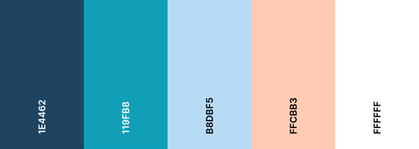

### Wireframes

Balsamiq has been used to show the appearance of the site on different devices

|Page | Desktop Version | Mobile Version |
|--- | --- | --- |
|Index |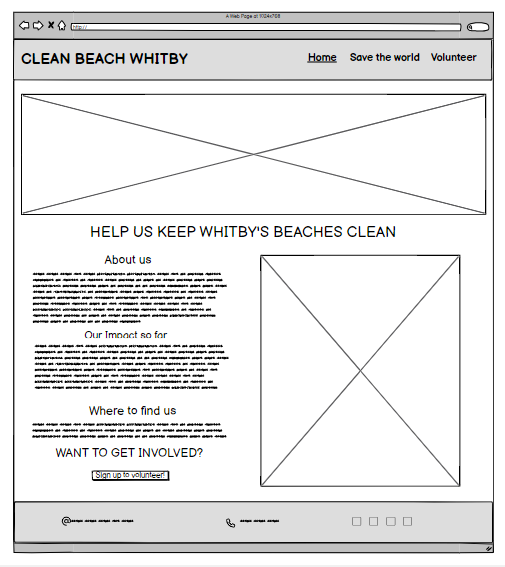 | 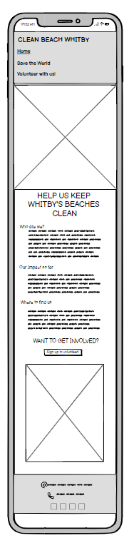 |
|Save the World | 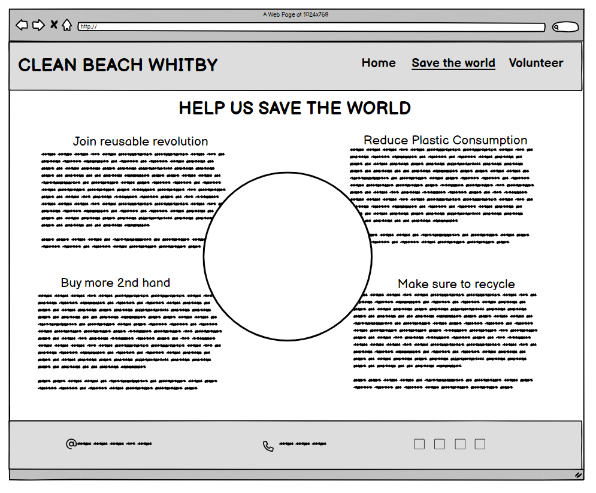 | 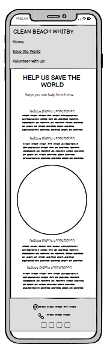 |
|Volunteer |  | 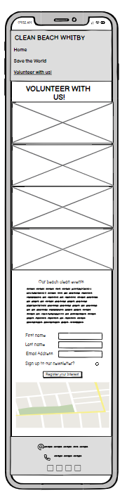 |

## Features

### General Features

- Logo & Nav bar
  - 
  - 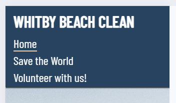
- Heading
- Footer
  - 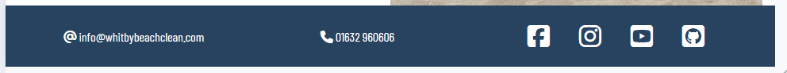
  - 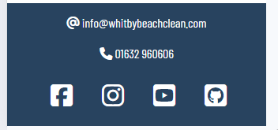

### Landing page

- body section informing the user the purpose of the group and what they have achieved
  - 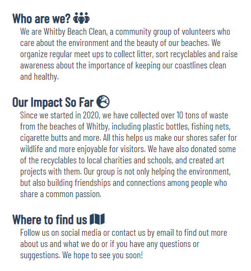
- button that takes the user to the form on the volunteer page
  - 

### Save the world page

- Main body section used to inform user other ways they can help at home.
  - 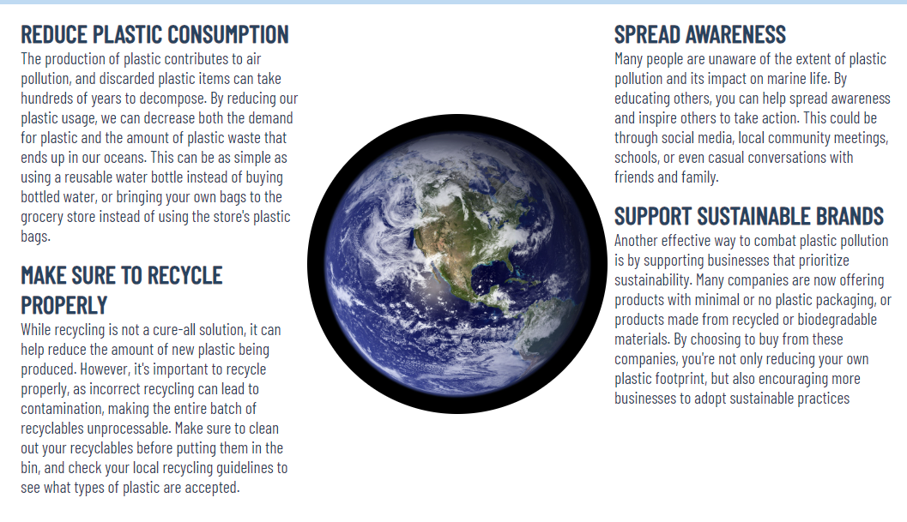

### Volunteer page

- gallery
  - 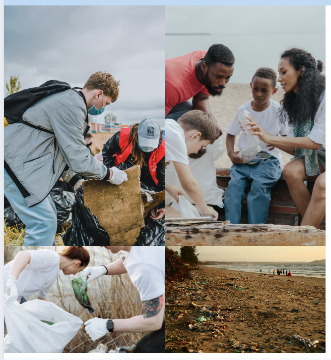
- sign up form
  - 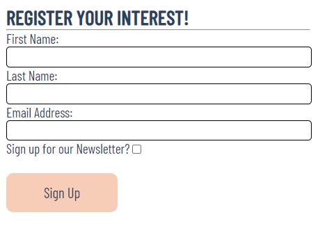
- map iframe
  - 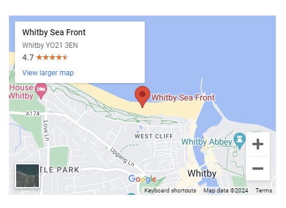

explain the value that each feature adds to the website

## Frameworks and Programs Used

- [Codeanywhere](https://app.codeanywhere.com/)
  - Codeanywhere was used for writing code, committing, and then pushing to GitHub. [GitHub](https://git*com/)
  - GitH*was used to store the project aft*ushing.

- [Google Fonts](https://fo*.google.com/)
    Google Fonts was used to import the fonts Barlow Condensed into the style.css file. These fonts were used throughout the site.

- [Font Awesome](https://fontawesome.com/)
  - Font Awesome was used throughout all pages to add icons in order to create a better visual experience for UX purposes.

- [Balsamiq](https://balsamiq.com/)
  - Balsamiq was used to create the wireframes during the design phase of the project.

- [Am I Responsive?](http://ami.responsivedesign.is/#)
  - Am I Responsive was used in order to see responsive design throughout the process.

- [Multi Device Website Mockup Generator](https://techsini.com/multi-mockup/index.php)
  - Responsive Design Checker was used in the testing process to check responsiveness on various devices and to generate mockup image.

- [Chrome DevTools](https://developer.chrome.com/docs/devtools/)
  - Chrome DevTools was used during development process for code review and to test responsiveness.

- [Coolers Contrast Checker](https://coolors.co/contrast-checker/112a46-acc8e5)
  - Coolers Contrast Checker was used to make sure the colors I used contrasted well enough for all users

### Languages used

The languages used in this project are:

- HTML
- CSS

## Testing

### Validator Testing

- The [W3C Markup Validator](https://validator.w3.org/) and [W3C CSS Validator](https://jigsaw.w3.org/css-validator/) services were used to validate all pages of the project in order to ensure there were no syntax errors.
#### Validation Errors

##### HTML
- Index Page
  - The W3C Markup Validator found errors where I had given a href value an alt attribute on the index page. I was able to delete this.
  - The W3C Markup Validator also found multiple stray end div tags that I deleted from the code.
  - The last error the validator found was that I had used a button as a descendent of an a element. I amended this by removing the button and applying css styling to the a attribute
  - 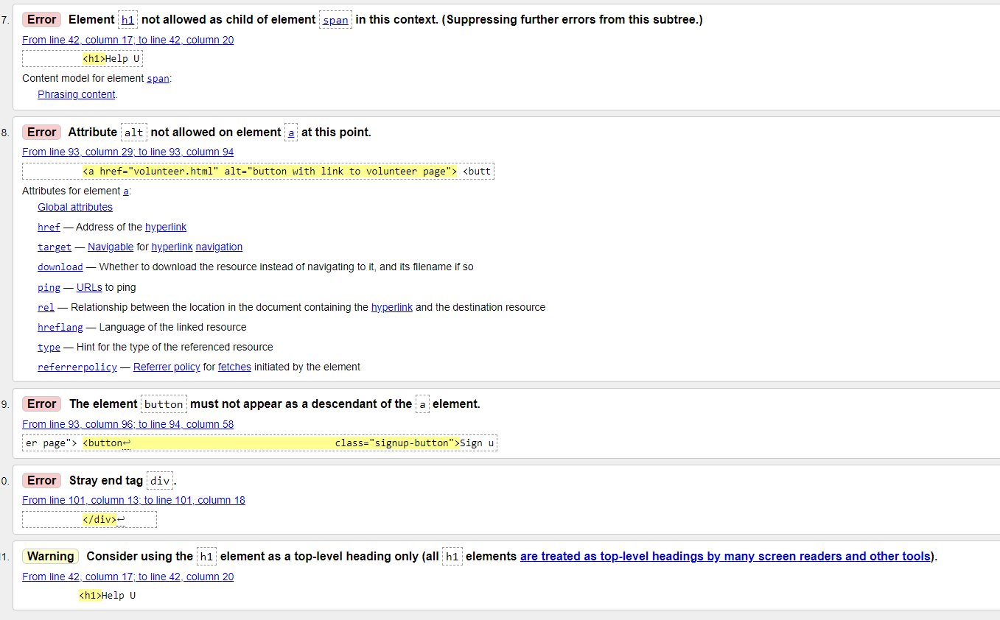
- Volunteer Page
  - The W3C Markup Validator found an error in the use of a % as a measurement on the Iframe. I fixed this by applying an ID and using a percentage through the CSS file. 
  - The W3C Markup Validator also found a stray end div tag that I deleted from the code.
  - 

##### CSS
- W3C CSS Validator found no errors or warnings on my CSS.

### Accessibility

Ensuring that our website is accessible to all users, regardless of their abilities or disabilities, is a priority for us. We strive to follow best practices to make our content usable by a wide audience. Here are some of the steps we have taken to enhance accessibility:

#### 1. Lighthouse testing

#### 2. Semantic HTML

Semantic HTML tags were used to provide a clear and meaningful structure to the webiste content. This helps screen readers and other assistive technologies interpret and convey information accurately.

#### 3. ARIA (Accessible Rich Internet Applications)

ARIA attributes were utilised on links to enhance the accessibility of the site allowing for screen readers to accurately pick up information.

#### 4. Contrast and Readability

[Coolers Contrast Checker](https://coolors.co/contrast-checker/112a46-acc8e5)was used to ensure  sufficient contrast in colors chosen to make the content readable for users with visual impairments.

#### 5. Alt Text for Images

All images on the website include descriptive alternative text (alt text). This helps users with visual impairments understand the content and context of images even if they cannot see them.

#### 6. Responsive Design

The website is responsive, providing a seamless experience across various devices and screen sizes. This benefits users with different abilities and ensures a consistent and accessible user experience.

### Manual testing

| Feature | Test case | Outcome |
| --- | --- | --- |
| Logo | | Click on the Logo | User is brought back to the home page |
| Nav bar - home | --- | --- |
| Nav bar - Save the world | --- | --- |
| Nav bar - Volunteer | --- | --- |
| --- | --- | --- |
| --- | --- | --- |

### Bugs

#### Solved bugs

#### Unfixed bugs

## Finished Product

| Page | Desktop | Mobile |
| --- | --- | --- |

## Deployment

### Github

- The following steps are to deploy the website to Github Pages from the GitHub repository:

    1. Log in to GitHub and locate the [GitHub Repository](https://github.com/).

    2. At the top of the Repository, locate the Settings button on the menu.

    3. Scroll down the Settings page until you locate the Pages section.

    4. Under Source, click the dropdown called None and select Master Branch.

    5. The page will refresh automatically and generate a link to your website.

## Credits

### Content

### Media

- [Pexels](https://www.pexels.com/)

  - Main hero image: "Body of Water under Blue and White Skies" by Matt Hardy.
  - Gallery image: "Volunteer People Picking Up Trash and Plastics" by Thirdman
  - Gallery image: "A Man and a Woman Looking at a Plastic Bottle" by Ron Lach
  - Gallery image: "People in Face Masks Cleaning Coast" by Kirill Ozerov
  - 2nd Index image: "A Family Campaigning to Save The Earth" by Ron Lach
  - Earth image: "Planet Earth" by Pixabay

- [Pixabay](https://pixabay.com/)

  - Gallery Image: "trash-pollution-beach-ocean-4897352" by Sergei Tokmakov

### Learning Resources

<https://css-tricks.com/snippets/css/a-guide-to-flexbox/>
<https://techsini.com/multi-mockup/index.php>
<https://www.w3schools.com/>
