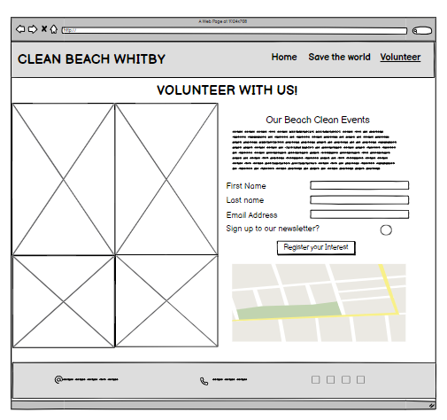

# Whitby Beach Clean

Whitby beach clean is a fictional community group located in the town of Whitby in Yorkshire, England. The group organises local events for all to help keep the beaches of the town clean and aims to educate members and the public on how to reduce plastic and ocean pollution.

The purpose of this website is to promote the community group and its events in the Whitby area. The target audience is both new and existing members of the community and of any demographic.

Please find a link to the deployed site [here](https://rdawson96.github.io/WhitbyBC/)

## Table of Contents

- [Whitby Beach Clean](#whitby-beach-clean)
  - [Table of Contents](#table-of-contents)
  - [User Experience](#user-experience)
    - [Project Goals](#project-goals)
    - [Colours Used](#colours-used)
    - [Wireframes](#wireframes)
  - [Features](#features)
  - [Frameworks and Programs Used](#frameworks-and-programs-used)
    - [Languages used](#languages-used)
  - [Testing](#testing)
    - [Validator Testing](#validator-testing)
    - [Manual testing](#manual-testing)
    - [Bugs](#bugs)
    - [Solved bugs](#solved-bugs)
  - [Accessibility](#accessibility)
    - [1. Lighthouse testing](#1-lighthouse-testing)
    - [2. Semantic HTML](#2-semantic-html)
    - [3. ARIA (Accessible Rich Internet Applications)](#3-aria-accessible-rich-internet-applications)
    - [4. Contrast and Readability](#4-contrast-and-readability)
    - [5. Alt Text for Images](#5-alt-text-for-images)
    - [6. Responsive Design](#6-responsive-design)
    - [Unfixed bugs](#unfixed-bugs)
  - [Finished Product](#finished-product)
  - [Deployment](#deployment)
  - [Credits](#credits)
    - [Content](#content)
    - [images I took](#images-i-took)
    - [Learning Resources](#learning-resources)

## User Experience

### Project Goals

- Inform users on the objectives of the community group
- Offer users the opportunity to sign up to hear more about the upcoming events

### Colours Used

### Wireframes

Balsamiq has been used to show the appearance of the site on different devices

|Page | Desktop Version | Mobile Version |
|--- | --- | --- |
|Index | |  |
|Save the World |  |  |
|Volunteer |  |  |

## Features

- General Features
  - Logo & Nav bar
    - [image of desktop top bar on all pages](assets/readme-images/desktop-nav-bar.png)
    - [image of mobile top bar on all pages](assets/readme-images/mobile-nav-bar.png)
  - Heading
  - Footer
    - [image of desktop footer on all pages](assets/readme-images/desktop-footer.png)
    - [image of mobile footer on all pages](assets/readme-images/mobile-footer.png)
- Landing page
- Save the world page
- Volunteer page
landing page

about the community group

button to sign up

other ways to help the planet

volunteer page with sign up form

gallery

explain the value that each feature adds to the website

## Frameworks and Programs Used

- [Codeanywhere](https://app.codeanywhere.com/)
  - GitPod was used for writing code, committing, and then pushing to GitHu*. [GitHub](https://git*com/)
  - GitH*was used to store the project aft*ushing.

- [G*g Fonts](https://fo*.google.com/)
    *-ogle Fonts was us* import the fonts Barlow Condensed into the style.css file. These fonts were used throughout the site.

- [Font Awesome](https://fontawesome.com/)
  - Font Awesome was used throughout all pages to add icons in order to create a better visual experience for UX purposes.

- [Balsamiq](https://balsamiq.com/)
  - Balsamiq was used to create the wireframes during the design phase of the project.

- [Am I Responsive?](http://ami.responsivedesign.is/#)
  - Am I Responsive was used in order to see responsive design throughout the process and to generate mockup imagery to be used.

- [Multi Device Website Mockup Generator](https://techsini.com/multi-mockup/index.php)
  - Responsive Design Checker was used in the testing process to check responsiveness on various devices.

- [Chrome DevTools](https://developer.chrome.com/docs/devtools/)
  - Chrome DevTools was used during development process for code review and to test responsiveness.

- [W3C Markup Validator](https://validator.w3.org/)
  - W3C Markup Validator was used to validate the HTML code.

- [W3C CSS Validator](https://jigsaw.w3.org/css-validator/)
  - W3C CSS Validator was used to validate the CSS code.

- [Coolers Contrast Checker](https://coolors.co/contrast-checker/112a46-acc8e5)
  - Coolers Contrast Checker was used to make sure the colors I used contrasted well enough for all users

### Languages used

## Testing

### Validator Testing

- The [W3C Markup Validator](https://validator.w3.org/) and [W3C CSS Validator](https://jigsaw.w3.org/css-validator/) services were used to validate all pages of the project in order to ensure there were no syntax errors.

- the W3C Markup Validator found errors where I had given a href value an alt attribute on the index page. I was able to delete this.
- the W3C Markup Validator also found multiple stray end div tags that I deleted from the index and volunteer page.
- the last error the validaot found was that I had used a button as a descendent of an a element. I amended this by removing the button and applying css styling to the a attribute
- W3C CSS Validator found no errors or warnings on my CSS.

### Manual testing

| Feature | Test case | Outcome |
| --- | --- | --- |
| Logo | | Click on the Logo | User is brought back to the home page |
| Nav bar - home | --- | --- |
| Nav bar - Save the world | --- | --- |
| Nav bar - Volunteer | --- | --- |
| --- | --- | --- |
| --- | --- | --- |

### Bugs

### Solved bugs

## Accessibility

Ensuring that our website is accessible to all users, regardless of their abilities or disabilities, is a priority for us. We strive to follow best practices to make our content usable by a wide audience. Here are some of the steps we have taken to enhance accessibility:

### 1. Lighthouse testing

### 2. Semantic HTML

We use semantic HTML tags to provide a clear and meaningful structure to our content. This helps screen readers and other assistive technologies interpret and convey information accurately.

### 3. ARIA (Accessible Rich Internet Applications)

We leverage ARIA attributes to enhance the accessibility of the site allowing for screen readers to accurately pick up information.

### 4. Contrast and Readability

We carefully choose color combinations and ensure sufficient contrast to make the content readable for users with visual impairments. Text sizes are adjustable, and we avoid using color as the sole means of conveying information.

### 5. Alt Text for Images

All images on our website include descriptive alternative text (alt text). This helps users with visual impairments understand the content and context of images even if they cannot see them.

### 6. Responsive Design

Our website is responsive, providing a seamless experience across various devices and screen sizes. This benefits users with different abilities and ensures a consistent and accessible user experience.

### Unfixed bugs

## Finished Product

## Deployment

## Credits

### Content

### images I took

### Learning Resources

<https://css-tricks.com/snippets/css/a-guide-to-flexbox/>
<https://techsini.com/multi-mockup/index.php>
